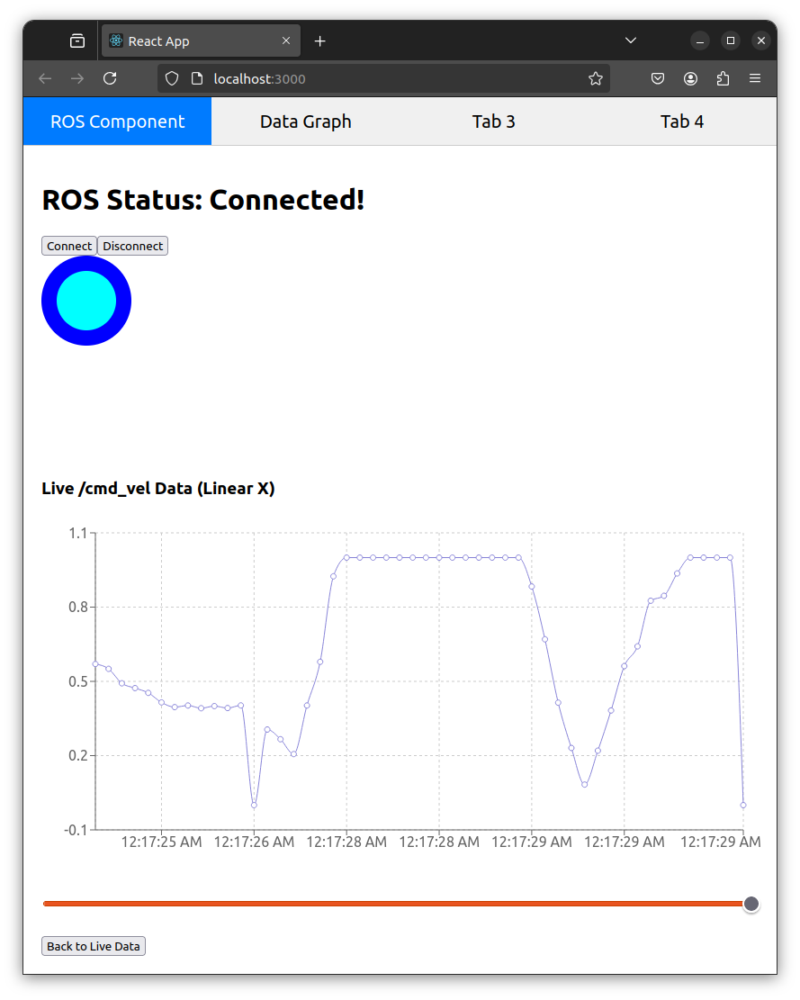

Current view:



new terminal:
```bash
ros2 launch rosbridge_server rosbridge_websocket_launch.xml 
```

new terminal:
```bash
cd nate-gui
export NODE_OPTIONS=--openssl-legacy-provider
npm start
```
